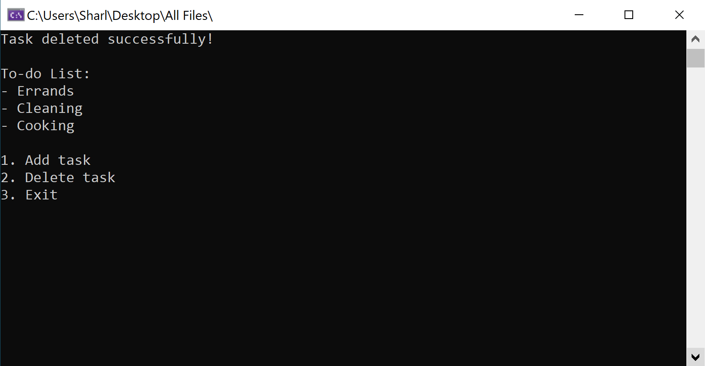

# CS-to-do-list
This is an example of how you can make a simple to-do list app as a C# console application

## To Run

* Click on the ToDo-List-Example/ToDo-List-Example.sln file to open the project in Visual Studio. Click on the green play button at the top of the window to run the program.

## Example

